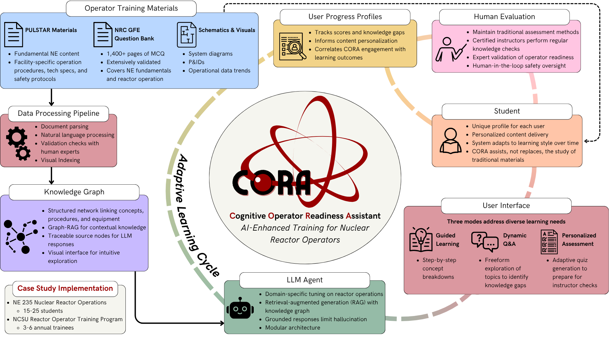

<!--
  GitHub Profile README — JasonClifford189
  Push location: github.com/JasonClifford189/JasonClifford189  (repo name MUST match username)
  This file becomes the landing page on github.com/JasonClifford189
-->

<!-- Headshot. Replace assets/headshot.jpg with your file. ~180px right-aligned for clean profile-card look. -->

# Jason Clifford

**Trustworthy AI for nuclear engineering.** NCSU + Argonne National Laboratory. Building the verification methodology that closes the regulatory gap between current LLM capability and safety-critical deployment.

[LinkedIn](https://www.linkedin.com/in/jason-p-clifford/) · [Google Scholar](https://scholar.google.com/citations?user=3WFax7MAAAAJ) · jpcliffo@ncsu.edu

---

## About

Master of Nuclear Engineering, NC State (May 2026), recognized as the College of Engineering's **Outstanding Masters Student of the Year**. My MNE thesis — *Toward Trustworthy Large Language Model Agents for Nuclear Engineering: System Design, Verification Methodology, and Operational Applications* — addresses the methodological gap the September 2024 [CANUKUS Trilateral guidance](https://www.nrc.gov/) (NRC / CNSC / ONR) explicitly flags: consensus standards for nuclear AI are *"unavailable in the near future,"* so any AI deployment in a nuclear setting today must produce its own statistical reliability evidence.

I'm a researcher on Dr. Xu Wu's [ARTISANS](https://artisans.ncsu.edu) team at NCSU and a Research Aide at Argonne National Laboratory's Mechanisms Engineering Test Loop (METL) under Dr. Alexander Heifetz. The two case studies in my work — MIRA at Argonne, CORA at the NCSU Nuclear Reactor Program — share a common architectural pattern: **constrained-decision-space agentic AI**, in which the LLM's job is to select from a verified candidate set rather than generate freely. The verification framework I developed alongside them produces the regulatory-grade evidence those deployments will need.

I build with agentic AI tools as a daily practice and treat AI-leveraged engineering as a craft, not a hack. Two refereed journal articles + ten conference proceedings to date.

---

## Headline finding

> **Across ~28,000 LLM responses on 250 NRC reactor-operator-certification questions and the TriviaQA corpus, 80–98% of safety-critical LLM error is *systematic deviation from ground truth* that consistency-based detection methods cannot see.** Consistency-blindness *rises* with model capability — from 63.9% (Claude Haiku 4.5) to 93.4% (Sonnet 4.6) to **94.6% (Opus 4.6)** — because the within-prompt stochastic signal that consistency methods rely on collapses 3.5×–7.3× as models become more deterministic.
>
> The result formalizes why surface trustworthiness of frontier LLM output is misleading and motivates a Lack-of-Fit-decomposition-based V&V framework that produces ground-truth-anchored statistical evidence consistent with the existing ASME V&V 10-2019 apparatus. *Best Presentation in Math, Computation, and AI, 2026 ANS Student Conference (Paper 11739).* Journal paper in preparation, summer 2026.

  

---

## Currently building

### V&V framework for nuclear AI

A unified, **application-agnostic** verification framework comprising three complementary methods:

- **K-refinement convergence testing** — an analog of mesh refinement in computational physics. Identifies the smallest retrieval depth *k* at which RAG-LLM accuracy stabilizes (the verified operating point).
- **Prompt perturbation analysis** — the LLM analog of classical sensitivity analysis. Quantifies robustness bounds across surface-level query variations (synonym, reorder, punctuation, filler, typo).
- **Lack-of-Fit (LOF) decomposition** — a novel ANOVA-based diagnostic that partitions LLM error into systematic deviation from ground truth (SSLOF) versus within-prompt stochastic variance (SSPE). The η² it produces is the fraction of error consistency methods cannot reach.

The framework is portable to any RAG–LLM deployment with a retrieval-depth parameter, controllable input perturbations, and verified ground-truth answers — a profile that fits a broad class of safety-critical industrial applications, including those covered by the [FAA AI Safety Assurance Roadmap](https://www.faa.gov/) and [FDA AI/ML SaMD Action Plan](https://www.fda.gov/). *Journal paper in preparation, summer 2026.*

### MIRA — METL Integrated Reasoning Assistant

Constrained-decision-space LLM agent providing natural-language access to sensor data at Argonne's [Mechanisms Engineering Test Loop](https://www.anl.gov/) (METL), a sodium-cooled fast reactor experimental facility critical to Generation-IV reactor development. Three-stage pipeline: semi-automated tag enrichment over ~300 expert-described heater-subsystem components → top-*k* FAISS retrieval over the ~6,000-tag METL pool → LLM selection agent (tested with Mistral-7B and Claude Sonnet 4). **90% selection accuracy at *k*=20, converged at *k*=16; 78.4% overall agreement under prompt perturbation.** Production deployment path via Argonne's data-secure Argo API for frontier-model inference inside the ANL firewall; voice-interface hardware installation scheduled Summer 2026 for hands-free field use. Lead developer.

  30 surfaces a distractor effect — excessive candidate context misleads LLM reasoning, departing from the classical 'finer is always better' expectation." width="560" />

### CORA — Cognitive Operator Readiness Assistant

Graph-RAG-based AI training assistant for NCSU Nuclear Reactor Program reactor-operator trainees, addressing the workforce-scaling bottleneck created by the U.S. quadruple-nuclear-capacity-by-2050 target (a national goal under which the certified-instructor pool, not reactor manufacturing, is the binding constraint). Built on a verified dual-subgraph knowledge graph that combines the **NRC Generic Fundamentals Examinations (GFE)** question bank (1,400+ pages of validated content) with PULSTAR-specific facility content; cross-subgraph edges encode `requires`, `depends-on`, `part-of`, and `safety-related-to` relationships. Three interaction modes (Guided Learning, Personalized Assessment, Dynamic Q&A) feed an adaptive learning cycle with per-trainee profiles and Certified Operator Verification gating before content reaches the active KG. Two-phase deployment: Fall 2026 NE 235 pilot (~20 students per offering), Spring 2027 NRP-trainee pilot (NRC-certification candidates). Lead developer.

  

### Madlib

Local-first knowledge-graph framework for thinking with AI — dogfooded daily on real research and writing work. Open-source release in flight.
<!-- Update once pushed: → [github.com/JasonClifford189/madlib](https://github.com/JasonClifford189/madlib) -->

---

## Selected publications

| Year | Venue | Paper |
|---|---|---|
| 2026 | ANS Student Conf. — *Best Presentation, Math/Comp/AI* | *Lack-of-Fit Decomposition for Detecting Systematic Error Modes in LLM Safety-Critical Reasoning* (Paper 11739) |
| 2026 | NUTHOS-15 | *(add: NUTHOS-15 paper title here)* |
| 2025 | ANS Winter Meeting | *(add: LLM-for-METL ANS Winter 2025 paper title here)* |
| — | — | *(add: 1–2 more strongest pubs from your CV)* |

Full list (2 refereed journal articles + 10 conference proceedings): [Google Scholar](https://scholar.google.com/citations?user=3WFax7MAAAAJ).

---

## Honors

- **Outstanding Masters Student of the Year**, NCSU College of Engineering, 2026
- **Best Presentation, Math / Computation / AI**, ANS Student Conference, 2026
- **Magna Cum Laude**, NCSU Nuclear Engineering, BS 2025
- *(add 4–5 more from CV honors section — ANS scholarships, NCSU departmental awards, etc.)*

---

## Get in touch

Open to conversations about AI safety / evals, V&V methodology for ML systems, agentic systems in safety-critical contexts, and nuclear-AI applications.

[LinkedIn](https://www.linkedin.com/in/jason-p-clifford/) · jpcliffo@ncsu.edu
